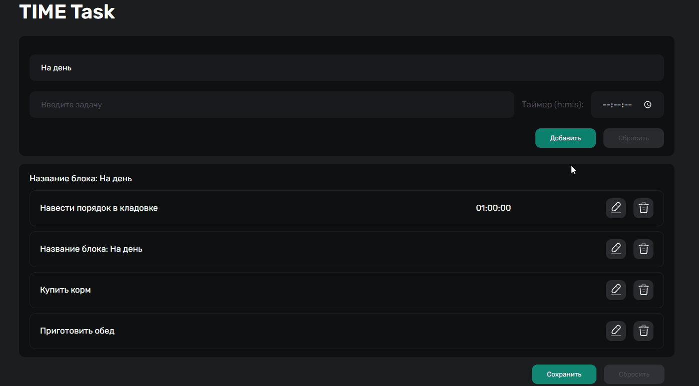
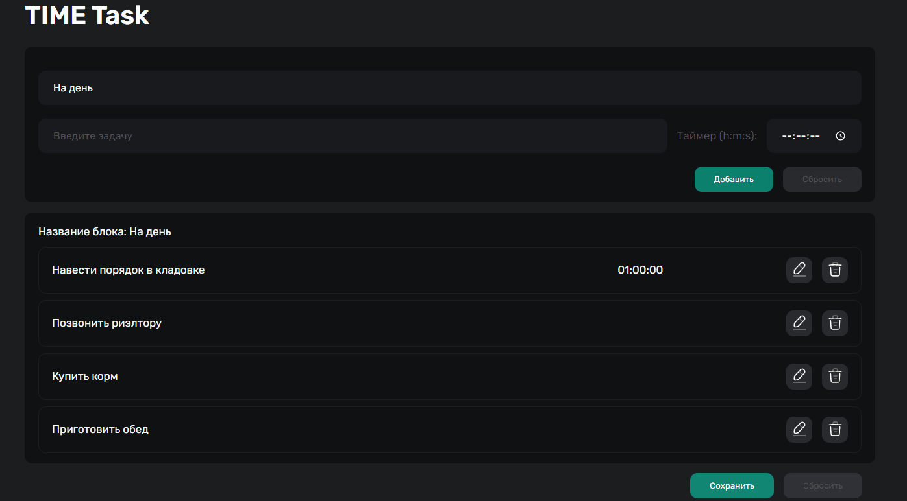

# Time Tasks (JS)

---


---

##Description

The time tasks implemented on JavaScript. The project was based on the approach SPA (single page application). Data is stored in the Local Storage.

---

##Opportunities
_1. Creating a new block and tasks_


_2. Edit and delete the task at the stage of creating a block. Reset data._


_3. Change the name of the block at the stage of creating a block._


_4. Start a timer (when the time expires, the sound signal will be given) and mark the task as completed._


_5. Delete the block._


---

##Project setup

```cmd
npm i
yarn dev
```
